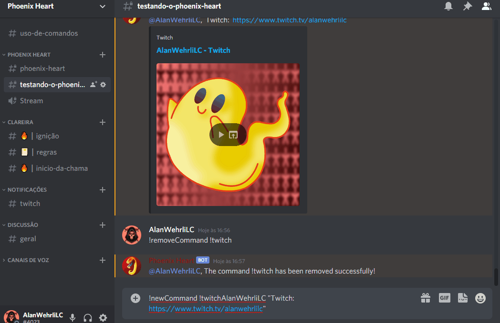
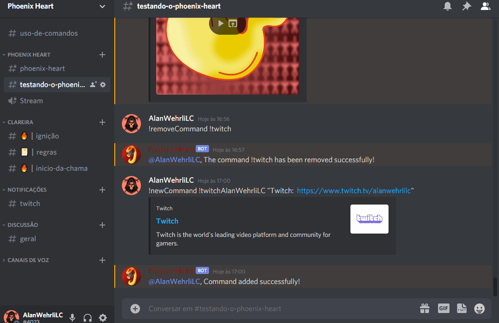
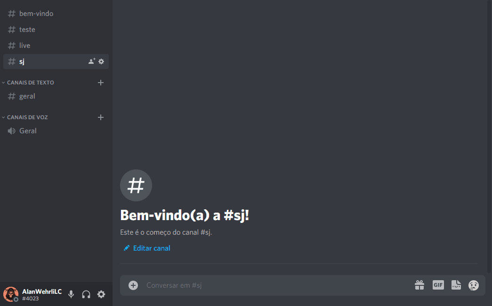
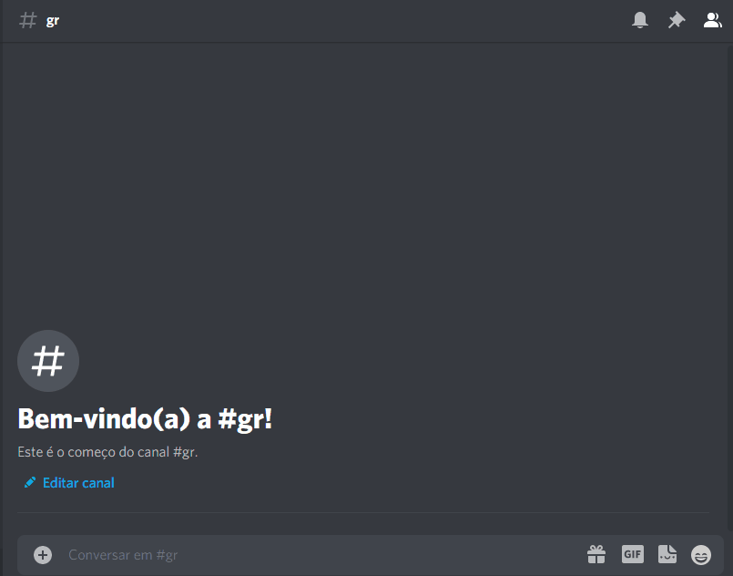
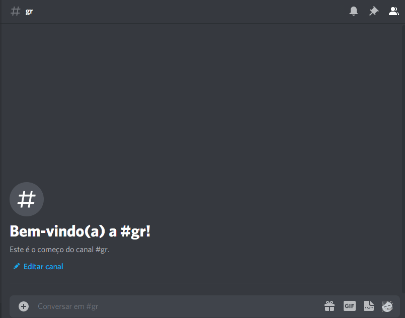
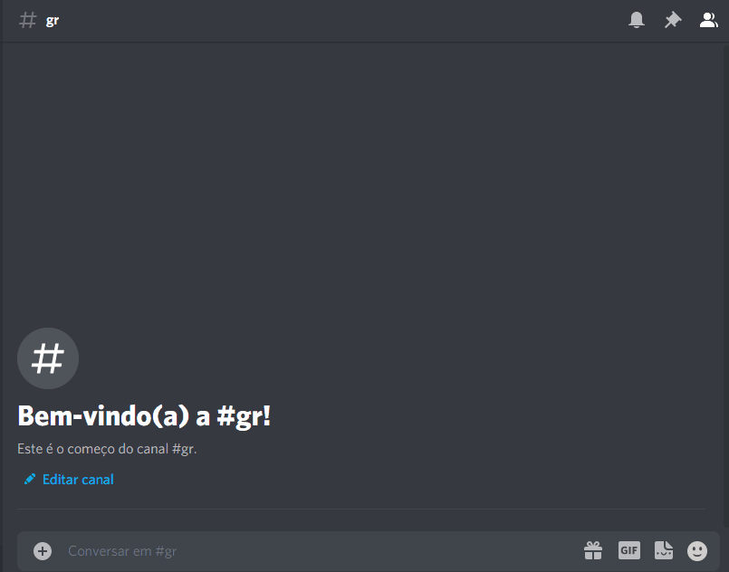
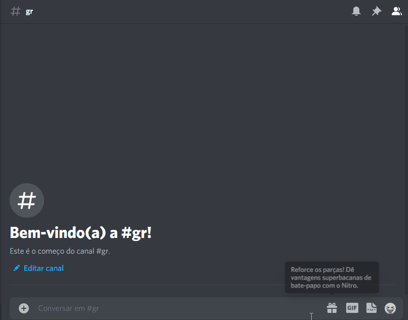
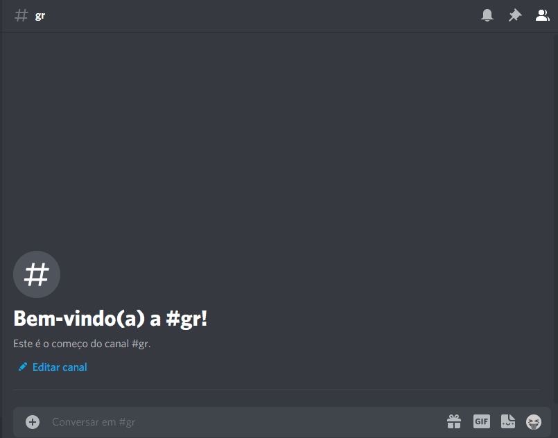
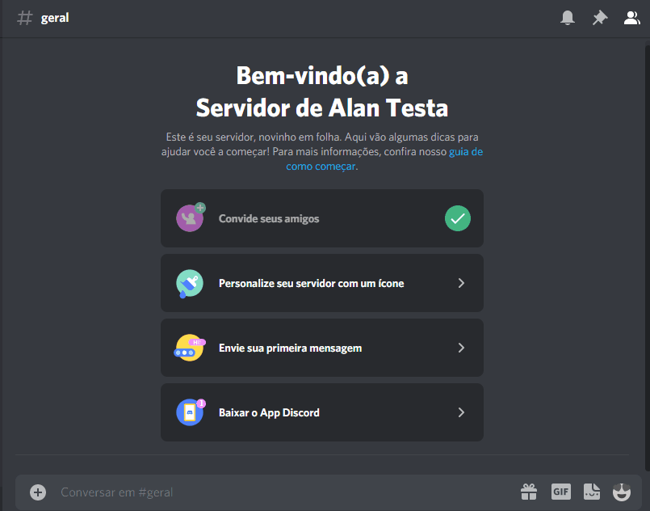
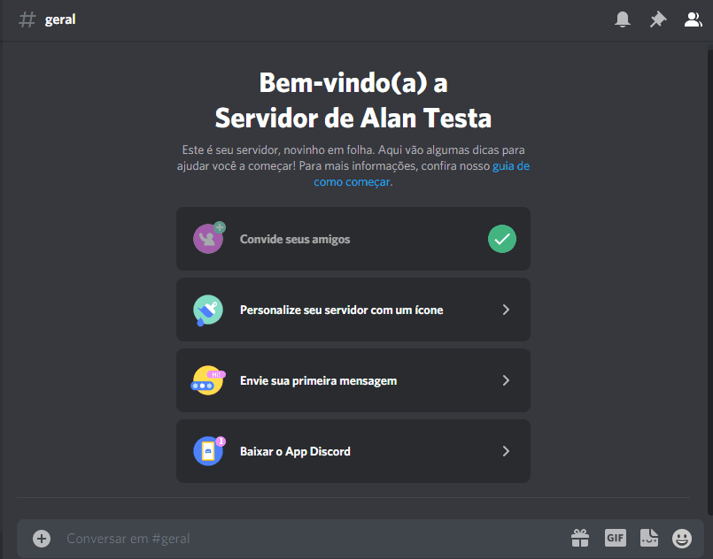

# Todos os comandos estão aqui!

  <a href="#comandos-do-administrador">Comandos do administrador</a>&nbsp;&nbsp;&nbsp;|&nbsp;&nbsp;&nbsp;
  <a href="#comandos-publicos">Comandos publicos</a>

## Comandos do administrador

- <a href="#new-command">!newCommand</a> 
- <a href="#remove-command">!removeCommand</a>
- <a href="#channel-id-config-discord-welcome">!channelIDConfigDiscordWelcome</a>
- <a href="#image-url-config">!imageURLConfig</a>
- <a href="#set-color-config">!setColorConfig</a>
- <a href="#set-title-config">!setTitleConfig</a>
- <a href="#set-description-config">!setDescriptionConfig</a>
- <a href="#channel-id-config-discord-twitch-status">!channelIDConfigDiscordTwitchStatus</a>
- <a href="#user-name-twitch-config">!userNameTwitchConfig</a>
- <a href="#live-message-twitch-config">!liveMessageTwitchConfig</a>
- <a href="#start-twitch-notifications">!startTwitchNotifications</a>

### New command

#### !newCommand

> > Serve para adicionar comandos personalizados no Discord, como por exemplo: `!twitchAlanWehrliLC`, que retorna no chat `Twitch:  https://www.twitch.tv/alanwehrlilc`

> Para adicionar um novo comando escreva no chat do Discord da seguinte maneira: `!newCommand !twitchAlanWehrliLC "Twitch:  https://www.twitch.tv/alanwehrlilc"`.
Coloque o conteudo do comando entre aspas duplas, por questão de padrão.

  

### Remove command

#### !removeCommand

> > Serve para remover um comando personalizado do Cloud Firestore, como por exemplo: `!twitchAlanWehrliLC`...

> Para remover um comando escreva no chat do Discord da seguinte maneira: `!removeCommand !twitchAlanWehrliLC`.

  

## Configurações para a mensagem de boas-vindas!

> Inicialmente é necessário adicionar em qual chat sera as boas-vindas.

### Channel ID Config Discord Welcome

> > Serve para adicionar onde sera a mensagem de boas-vindas.

> É necessário adicionar o ID do chat, para pegar o ID, utilize a barra invertida e mencionado o chat: ` \#sj `

  

> > > Para adicionar o ID do chat, escreva no chat do Discord da seguinte maneira: `!channelIDConfigDiscordWelcome 830904950740615219`

  

### Image URL Config

> > Serve para adicionar uma imagem ou gif na mensagem de boas-vindas.

> Para adicionar um link, escreva no chat do Discord da seguinte maneira: `!imageURLConfig https://i.imgur.com/ugNDTI5.gif`

  

### Set Color Config

> > Serve para adicionar uma cor na mensagem de boas-vindas.

> Para adicionar a cor, escreva no chat do Discord da seguinte maneira: `!setColorConfig #ef3027`. A cor deve ser no formato de hexadecimal.

  

### Set Title Config

> > Serve para adicionar um título na mensagem de boas-vindas.

> Para adicionar um título, escreva no chat do Discord da seguinte maneira: `!setTitleConfig Boas-Vindas`

  

### Set Description Config

> > Serve para adicionar um descrição na mensagem de boas-vindas.

> Para adicionar uma descrição, escreva no chat do Discord da seguinte maneira: `!setDescriptionConfig Seja Boas-Vindas ao servidor!`

  

## Configurações para as notificações de lives da twitch 

> Inicialmente é necessário adicionar em qual chat sera as notificações de lives da twitch.

### Channel ID Config Discord Twitch Status

> > Serve para adicionar onde sera as notificações de lives da twitch.

> É necessário adicionar o ID do chat, para pegar o ID, utilize a barra invertida e mencionado o chat: ` \#gr `

  

> > > Para adicionar o ID do chat, escreva no chat do Discord da seguinte maneira: `!channelIDConfigDiscordTwitchStatus 830904950740615219`

  

### User Name Twitch Config

> > Serve para adicionar qual canal da twitch, sera a notificação.

> É necessário pegar o nome do canal da twitch `AlanWehrliLC`

> > > Para adicionar o nome do canal da twitch, escreva no chat do Discord da seguinte maneira: `!userNameTwitchConfig AlanWehrliLC`

  

### Live Message Twitch Config

> > Serve para adicionar um descrição na mensagem da notificação.

> Para adicionar uma descrição, escreva no chat do Discord da seguinte maneira: `!liveMessageTwitchConfig A live já começo!`

  

## Depois que tudo estiver configurado é hora de iniciar as notificações

## Start Twitch Notifications

> > Serve para adicionar um descrição na mensagem da notificação.

> Para adicionar uma descrição, escreva no chat do Discord da seguinte maneira: `!startTwitchNotifications`

> > "Esse comando não mostra que esta funcionado!"

  

  

## Comandos publicos

- <a href="#commands">!commands</a>
- <a href="#usando-os-comandos-adicionados">Usando os comandos adicionados</a>

### !commands

> > Para saber quais comandos foram adicionados, basta colocar o comando `!commands`

  

#### Usando os comandos adicionados

> > Para usar o comando adicionado, basta colocar o comando `!twitchAlanWehrliLC`

  

